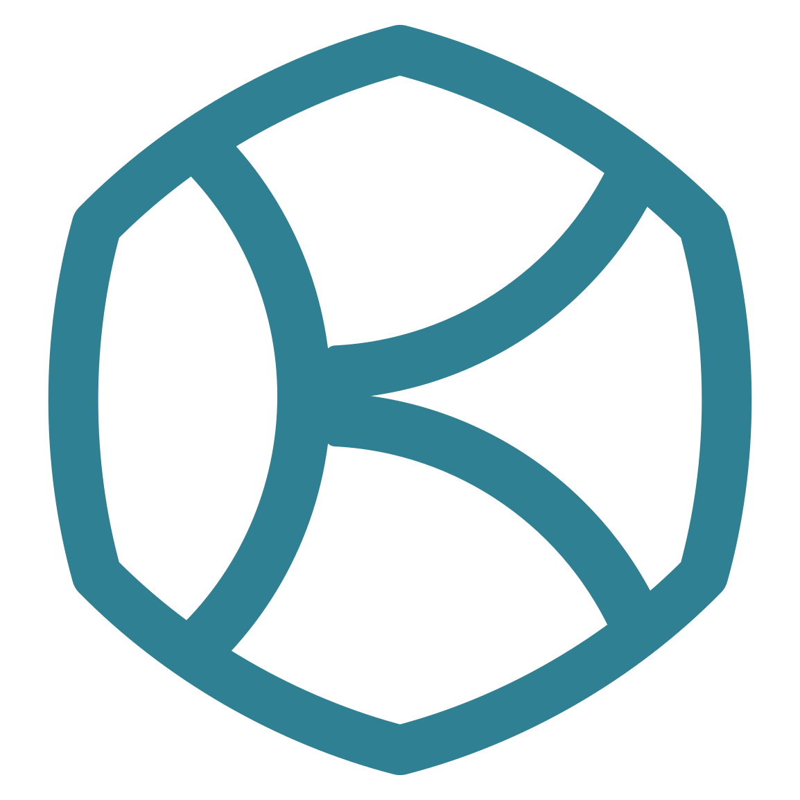

<div align="center">



# Krither

### La traçabilité blockchain pour les petits et moyens producteurs

*Transparent. Inaltérable. Fait pour les artisans.*

<br />


</div>

---

## 📖 Présentation

**Krither** permet aux petites et moyennes entreprises — producteurs
alimentaires, artisans, créateurs — de prouver l'origine et le parcours de
leurs produits. Chaque lot est frappé sur la blockchain sous forme de jetons
ERC-1155, un identifiant de jeton par article, et chaque étape de sa vie est
ajoutée sous forme d'événement que personne ne peut réécrire. L'acheteur scanne
un QR code et lit tout l'historique directement depuis la chaîne.

Le gas n'est pas le problème du producteur : un paymaster ERC-4337 sponsorise
ses opérations contre un abonnement, si bien qu'un producteur n'a jamais besoin
de détenir d'ETH pour enregistrer quoi que ce soit.

---

## ✨ Pourquoi Krither

| | |
| :---: | :--- |
| 🔍 | **Transparence** — chaque étape du parcours d'un produit est vérifiable publiquement. |
| 🔒 | **Inaltérabilité** — le CID des métadonnées d'un lot est figé à la frappe et ne peut jamais être modifié. |
| ⛽ | **Sans gas** — comptes intelligents et paymaster : les producteurs travaillent sans détenir d'ETH. |
| 🤝 | **Accessible** — conçu pour les petites coopératives et les artisans indépendants. |
| 🛒 | **Confiance pour l'acheteur** — un QR code donne toute la provenance on-chain, sans wallet. |

---

## ⚙️ Fonctionnement

```
  Producteur                    Tout détenteur              Tout le monde
     │                              │                            │
     │ mintLot(quantities,          │ addLifecycleChange(        │ scan du QR
     │         cid, ref)            │   idItem, cid)             │
     ▼                              ▼                            ▼
  ┌─────────────────────────────────────────────┐        ┌──────────────┐
  │  KritherRegistry (ERC-1155)                 │───────▶│  /verify/... │
  │  lots, articles, événements, rôles          │  logs  │ page publique│
  └─────────────────────────────────────────────┘        └──────────────┘
                    ▲ lit chaque rôle en direct
  ┌─────────────────────────────────────────────┐
  │  KritherPaymaster (ERC-4337)                │
  │  formules, quotas, sponsoring du gas        │
  └─────────────────────────────────────────────┘
```

1. Un administrateur des utilisateurs accrédite le compte intelligent du
   producteur (`grantRole`).
2. Le producteur achète une formule au paymaster ; ses opérations deviennent
   gratuites en gas.
3. Il épingle un répertoire de métadonnées sur IPFS et frappe le lot - un
   identifiant ERC-1155 par article, le CID du répertoire figé pour toujours.
4. Toute adresse détenant des unités d'un article y ajoute des étapes de cycle
   de vie au fil des transmissions.
5. Les pages publiques `/verify` reconstruisent toute la chronologie à partir
   des logs.

---

## 🗂️ Monorepo

| Dossier | Stack | README |
| :--- | :--- | :--- |
| 📜 `hardhat-env` | Solidity 0.8.31, Hardhat 3, OpenZeppelin, tests en viem | [hardhat-env/README.md](hardhat-env/README.md) |
| 🖥️ `next-env` | Next.js 16, shadcn/ui, wagmi/viem, Reown AppKit, Prisma | [next-env/README.md](next-env/README.md) |

Chaque workspace gère ses propres dépendances avec **pnpm** et documente sa
propre installation, ses variables d'environnement et ses conventions.

### Surface on-chain

| Contrat | Ce qu'il porte |
| :--- | :--- |
| `KritherRegistry` | Lots et articles ERC-1155, événements de cycle de vie, tous les rôles, le coupe-circuit |
| `KritherPaymaster` | Paymaster ERC-4337 : formules, abonnements, quotas, trésorerie du gas |
| `KritherAccountFactory` | `SimpleAccountFactory` v0.8 de référence, comptes intelligents contrefactuels |

Tous les rôles vivent dans le registre : `DEFAULT_ADMIN_ROLE`,
`USERS_ADMIN_ROLE`, `PLANS_ADMIN_ROLE`, `PAUSER_ROLE`, `PAYMASTER_ROLE`,
`PRODUCER_ROLE`, `RESELLER_ROLE`, `CONSUMER_ROLE`. Le frontend ouvre un espace
du tableau de bord par rôle.

---

## 🎨 Identité

### Logo

`next-env/public/logo/` fournit la marque en SVG et en PNG ; les composants
React de `next-env/src/components/brand/Logo.tsx` font référence et héritent de
`currentColor`.

| Composant | Usage |
| :--- | :--- |
| `KritherMark` | Marque fine, la version par défaut |
| `KritherMarkBold` | Marque grasse, pour les petites tailles et les favicons |
| `KritherWordmark` | « KRITHER » seul |
| `KritherLockupHorizontal` | Marque et mot côte à côte |
| `KritherLockupVertical` | Marque au-dessus du mot |

### Palette

Définie une seule fois en `--k-*` dans `next-env/src/app/globals.css`, puis
projetée sur les tokens shadcn en clair et en `.dark`.

| | Token | Hex | Rôle |
| :---: | :--- | :--- | :--- |
|  | `--k-blue-ink` | `#2f8093` | `--primary` en clair, la couleur propre du logo |
|  | `--k-blue` | `#59b5ca` | `--primary` en sombre |
|  | `--k-blue-deep` | `#266978` | `--primary-hover` |
|  | `--k-green` | `#79caac` | `--proof`, l'accent des provenances vérifiées |
|  | `--k-green-ink` | `#2d7158` | `--success` |
|  | `--k-grey` | `#c9d1dd` | `--secondary`, `--surface` |
|  | `--k-amber` | `#b45309` | `--warning` |
|  | `--k-red` | `#b91c1c` | `--destructive` |

Les neutres vont de `--k-grey-50` (`#f7f8fa`) à `--k-grey-900` (`#181d26`), qui
sert de fond en sombre ; le mode clair est du blanc pur sur du noir pur.

### Typographie

**Inter** partout (`--font-sans`), **JetBrains Mono** pour les adresses, les
hashes et les CID (`--font-mono`), toutes deux chargées via
`next/font/google`.

> Toujours passer par les tokens (`bg-primary`, `text-muted-foreground`,
> `text-proof`), jamais par un hex en dur.

---

## 🚀 Démarrage

### 📜 Contrats

```bash
cd hardhat-env
pnpm install
pnpm hardhat compile
pnpm hardhat test
```

Déploiement sur Sepolia, puis envoi des ABI et des adresses obtenues vers le
frontend :

```bash
pnpm deploy:sepolia
pnpm sync:abi
```

### 🖥️ Frontend

```bash
cd next-env
pnpm install
pnpm dev
```

Puis ouvrir **http://localhost:3000**.

> ℹ️ Le frontend attend un `.env.local` (identifiant de projet Reown, RPC, clé
> Etherscan, accès Pinata, URL de la base, secret de session, adresses des
> contrats). Le tableau complet est dans
> [next-env/README.md](next-env/README.md#7-environment).

---

## 📌 Statut

> 🚧 **En développement** — déployé sur Sepolia, non audité, pas destiné à la
> production.

---

<div align="center">

**Krither** · La transparence de la blockchain au service de ceux qui cultivent et façonnent.

</div>
